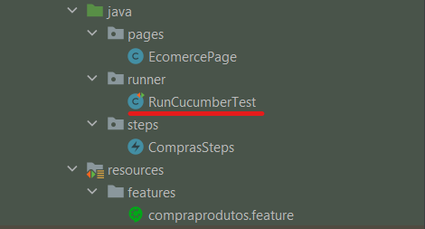
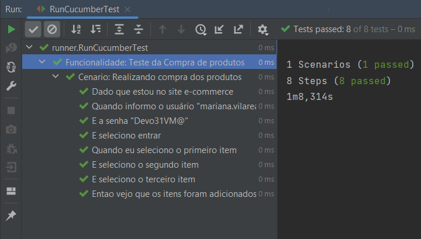

# Automação Datum

## Como executar o projeto

* Importante ter o Java instalado ( Versão 11 ou superior)
* Importante ter o Maven instalado ( Versão 3.6.0 ou superior) 
* Chromedriver já está dentro da pasta do projeto na versão 115
* Importante ter o navegador na mesma versão

Execute a Classe RunCucumberTest para executar todos os cenários

Resultado esperado é que todos os testes tenha sido executado com sucesso!

